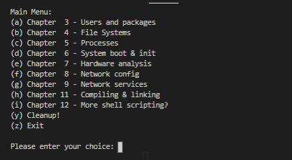

You can get it from the [release](https://github.com/Dorian-Grim/SOhomework/releases/tag/v1.0.0) or clone it

# SOhomework

This project was made during my studies at UTM Informatics, year I, semester 1, with the help of two colleagues (more or less two, at little bit more over to one). For the Operating Systems course. The original idea and initial code was authored by [Mihai Fologea](https://github.com/mihailfox/), we just kept on building on that. It represents a summary of commands from this [book](https://www.scribd.com/doc/40018134/Introducere-in-sisteme-de-operare-By-Rughini%C8%99-R-Deaconescu-R-Milescu-G-Bardac-M), placed into a terminal menu for the user to interact with.

You can see all commits [here](https://github.com/Dorian-Grim/temaSO/commits/master)

# Running the project on Windows

Follow this beatiful tutorial [here](https://code.visualstudio.com/docs/remote/wsl-tutorial). Then, using the vscode terminal, while connected in the remove window with the remote subsystem active, navigate to your local folder with the project and run [main.sh](scripts/main.sh)

# Running the project on a Linux

This is more straight forward, just navigate to your local project folder and run [main.sh](scripts/main.sh) like so `bash main.sh`

#

On both scenarios you should see this

